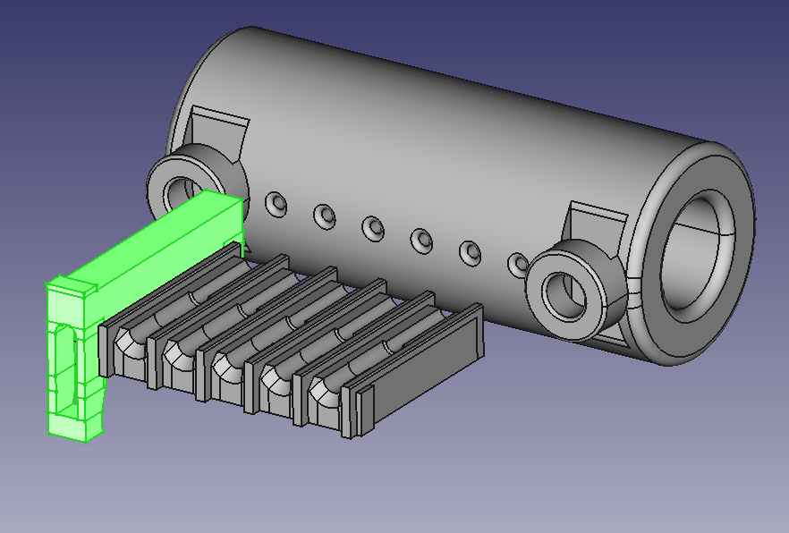

This assembly aims to allow rapidly exchanging groups of 6 odor vials.

### Bill of materials

| Description | McMaster Part Number | Quantity |
| ---         | ---                  | ---      |
| 5/32" OD tube stem to 10-32 thread | [5779K623](https://www.mcmaster.com/5779K623) | 6 |
| Junction block (6 position, 10-32 thread) | [5091K61](https://www.mcmaster.com/5091K61) | 1 + 1 per-exchangeable-side |
| Female 5/32" OD push-to-connect to 10-32 thread | [7880T115](https://www.mcmaster.com/7880T115) | 6 per-exchangeable-side |
| 10-32 thread to barb for 1/16" ID tube | [2974K123](https://www.mcmaster.com/2974K123) | 6 + 6 per-exchangeable-side (2 packs of 10) | 
| Release bar | N/A (3D printed from `release_bar.stl`) | 1 |
| Mounting screws | [92185A992](https://www.mcmaster.com/92185A992) | 1 (25 pack) |

The [tube stems (5779K623)](https://www.mcmaster.com/5779K623) can each be replaced with
a combination of an additional [female push-to-connect (7880T115)](https://www.mcmaster.com/7880T115)
and a [female-to-female tube stem adapter (5779K349)](https://www.mcmaster.com/5779K349)
, which is substantially cheaper at current prices. Making this substitution will
introduce another joint that could be more likely to leak.

See our [11-channel olfactometer repo](https://github.com/ejhonglab/11channel_olfactometer)
for the context in which we use this assembly, along with a parts list to build it.

### Assembly

To drill the 6 holes the needles will be inserted into (in the 1/4" ID, 3/8" OD PTFE
tube; see 11 channel olfactometer bill of materials), print
`needle_drill_guide_for_ptfe_tube.stl` and lightly clamp it do the PTFE tube using M3
fasteners. `needle_drill_guide_for_ptfe_tube.3mf` should contain the same model as the
STL, but also has a support enforcer to only generate supports in a place where they
should be easy to remove. Use a smaller drill than the diameter of the needles (maybe <=
3/64"), and you should be able to get several uses out of the drill guide. If making
several rows of holes, offset them enough so that the needles will not interfere with
each other when inserted.

`needleclamp_top_with_supports.stl` should be printed in an orientation where one side
of each latch is flat against the bed, so that layer lines do not make the latch more
fragile.  I used PETG and a 0.4mm nozzle, without many changes to the bridging settings,
and no supports added. Any internal supports would make the part harder to clean up, and
doing so would risk damaging the latches, so the part has a rectangle opposite the space
for the needle, which you should cut off of each latch (e.g. with a razor blade). An
initial attempt to print the part using a 0.6mm nozzle did not make good parts, because
the bridging performance was different, although limited internal supports or different
settings could possibly fix that. I leave one of these parts semi-permanently attached
to the end of each odor vial I'm actively using, to minimize setup time.

### 3D-printed parts

All parts (except the drill guide) should be printed with high infill. I used 100%.

I printed most parts on a Prusa i3 MK3S with PETG filament. All parts should be
printable with either a 0.4 or 0.6mm nozzle, *except* `needleclamp_top.stl`, which I so
far only got good parts with a 0.4mm nozzle.

I used PrusaSlicer
`2.2`-`2.3` to slice the `.stl` files to `.gcode`.

#### Regenerating STLs

To generate `release_bar.stl`:
1. Open `6channel_quick_disconnect.FCStd` in FreeCAD
2. Select `release_bar` in the tree view at the left. May need to expand
   `6channel_quick_disconnect` first.
3. `File->Export` (or `Ctrl-e`). Under the `Files of type:` menu at the bottom, select
   `STL Mesh (*.stl *.ast)`. Rename file to `release_bar.stl`. Press `Save`.

`needle_clamp_and_drill_guide.FCStd` contains the models for:
- `needleclamp_top_with_supports.stl`
- `needleclamp_bottom.stl`
- `needle_drill_guide_for_ptfe_tube.stl`

The `*.FCStd` files were produced with FreeCAD `0.19`-`0.20`.

The models for the McMaster-Carr parts in `6channel_quick_disconnect.FCStd` came from
the McMaster website.

### Operation

#### Push-to-connect (air inputs to odor vials)

Before matching the two sides of this assembly (i.e. pushing the tube stems into the
female push-to-connect adapters), check that you have a release bar placed around the
row of male tube stems. Then, firmly squeeze both sides of the assembly from the
aluminum passthru blocks. To disconnect the two sides of the assembly, press the release
bar down (so it presses all of the release rings on the female push-to-connect
fittings), and then pull the two sides apart.

#### Needleclamp (odor vial outputs)

Both the top and bottom of the needleclamp have a ridge to indicate which side has a
wider internal diameter. The clamp tops should be inserted so that their ridge is on the
same side as the ridge on the clamp bottom, and the section of the needle covered with
the PTFE tubing should go in this half of the clamp.

The section of the needle with PTFE tube over it should go (at most) halfway down the
needleclamp top, as if the PTFE overlaps with the thinner internal diameter of the
needleclamp top, the top and bottom of the clamp won't close all the way. When all slots
in the clamp are populated, the top surfaces of all the clamp tops should be flat. If
any are sticking out, check whether the PTFE section is inserted too far. If the needles
are not in a straight enough line to insert, it also likely indicates a clamp is not
seated fully.

