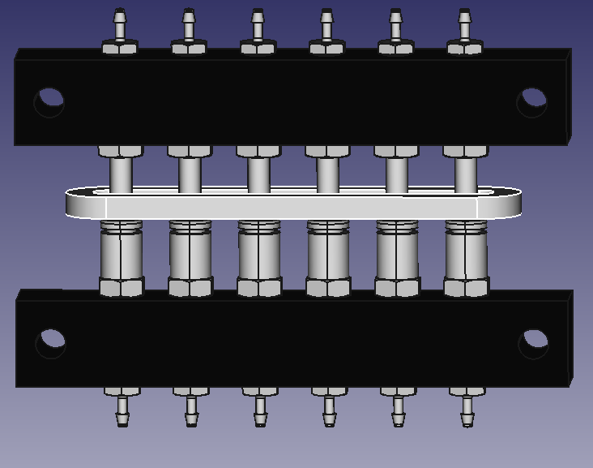

This assembly aims to allow rapidly exchanging groups of 6 odor vials.

### Bill of materials

| Description | McMaster Part Number | Quantity |
| ---         | ---                  | ---      |
| 5/32" OD tube stem to 10-32 thread | [5779K623](https://www.mcmaster.com/5779K623) | 6 |
| Junction block (6 position, 10-32 thread) | [5091K61](https://www.mcmaster.com/5091K61) | 1 + 1 per-exchangeable-side |
| Female 5/32" OD push-to-connect to 10-32 thread | [7880T115](https://www.mcmaster.com/7880T115) | 6 per-exchangeable-side |
| 10-32 thread to barb for 1/16" ID tube | [2974K123](https://www.mcmaster.com/2974K123) | 6 + 6 per-exchangeable-side | 
| Release bar | N/A (3D printed from `release_bar.stl`) | 1 |

`6channel_quick_disconnect.FCStd` produced with FreeCAD `0.19`. All parts
besides `release_bar` were derived from McMaster-Carr supplied 3D models.

To generate `release_bar.stl`:
1. Open `6channel_quick_disconnect.FCStd` in FreeCAD
2. Select `release_bar` in the tree view at the left. May need to expand
   `6channel_quick_disconnect` first.
3. `File->Export`. Under the `Files of type:` menu at the bottom, select
   `STL Mesh (*.stl *.ast)`. Rename file to `release_bar.stl`. Press `Save`.

I used PrusaSlicer `2.2.9.1` to slice the `.stl` to the `.gcode` file.

Only use `release_bar_0.15mm_PLA_MK3S_29m.gcode` if printing with PLA on a Prusa
i3 MK3S / MK3S+ printer. Otherwise, slice `release_bar.stl` with settings
specific to your 3D printer.

